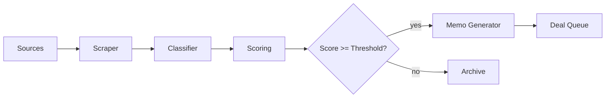

# Process Flows

## Investor Onboarding
1. Create account (frontend) → /v1/investors
2. Upload KYC → /v1/investors/{id}/kyc (mock verifier)
3. Subscription terms created → smart contract (off-chain call)
4. Status updates via webhooks

## Deal Sourcing
1. Scraper pulls public infra tenders/data
2. Classifier tags sector, geo, stage
3. Scoring engine: ROI, risk, ESG, carbon
4. Auto-memo generated & pushed to review queue

## Execution
- Generate LOI/term sheet from template
- Track approvals
- Persist to ledger (plugin point for chain)

## Monitoring & Reporting
- Ingest operational metrics (IoT placeholders)
- Compute KPIs (IRR to-date, ESG impact)
- Generate quarterly PDF + dashboard updates

Mermaid (high-level):

